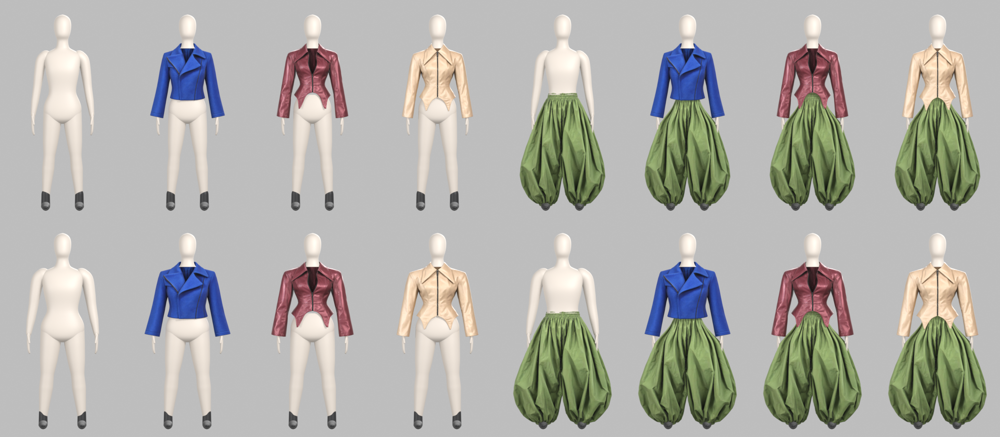

# Virtual Try-On

A browser-based 3D try-on for a four-piece capsule: three cropped jackets and a pair of balloon trousers, shown on faceless mannequins in sizes **S** and **L**. Shoppers pick a size, layer a jacket over the trousers and rotate the look 360°.



## What's in here

| Path | What it is |
|---|---|
| `index.html` | Landing page linking the two demos |
| `fitting-room/` | Standalone try-on: size switch, tops, bottoms, turntable |
| `store-mockup/` | The try-on inside a Shopify-style product page (colour and size drive the 3D view, "Complete the look" adds the trousers). Store name, prices and copy are placeholders. |
| `models/` | Web-ready GLB files (about 4–5 MB per garment, 1.8 MB per mannequin) and `fit.json` |
| `blender/` | Blender 5.x scripts that built the mannequins, optimised the garments and rendered the checks |
| `docs/` | Contact-sheet renders of every look |

## Run it locally

The pages load `.glb` files with `fetch`, so they need to be served over HTTP (opening the file directly won't work):

```bash
python -m http.server 8000
```

Then open http://localhost:8000.

To host it for free, enable **GitHub Pages** (Settings → Pages → deploy from the `main` branch, root folder).

## How the try-on works

- **Mannequins** (`blender/build_avatar.py`) are built procedurally and split into named parts: `head`, `torso_upper`, `hips`, `arms`, `hands`, `legs`, `feet`. Each garment lists the parts it covers in `models/fit.json` (`hides`), and the viewer hides them so the body never pokes through the clothes.
- **Sizes**: S is the base fit. L scales the body and the garments by 1.15 in girth with the same height. This approximates a size change; it isn't a true pattern grade.
- **Layering**: when a jacket is worn, the upper part of the trousers is pulled in slightly (`tuck_under_top` in `fit.json`) so peplum hems sit over the trousers.
- **Garments** are static meshes (no cloth simulation), so they turn with the camera but don't move like fabric.

## Rebuilding the assets (Blender 5.x)

```bash
# web-weight copy of a source garment: decimate to ~100k tris, 2K textures, real-world height in metres
blender -b --factory-startup -P blender/optimize.py -- source.glb models/garment.glb 0.62

# rebuild both mannequins into models/
blender -b --factory-startup -P blender/build_avatar.py -- models

# render a contact sheet of every look
blender -b --factory-startup -P blender/render_looks.py -- models docs/looks.png S,L front 260
```

`blender/measure.py` and `blender/inspect.py` print garment cross-sections and stats; `blender/procedural_jacket.py` is an early code-only jacket model, kept for reference.

## Adding a garment

1. Export the garment as GLB and run `optimize.py` on it.
2. Add an entry to `models/fit.json` (`slot`, `scale`, `offset`, `hides`) and to the catalogue at the top of each page's script.
3. Render a contact sheet with `render_looks.py` to check the fit on both mannequins.

## Credits

Garment models were generated from product photos with an image-to-3D tool, then optimised in Blender. Rendering uses [three.js](https://threejs.org) r170.
